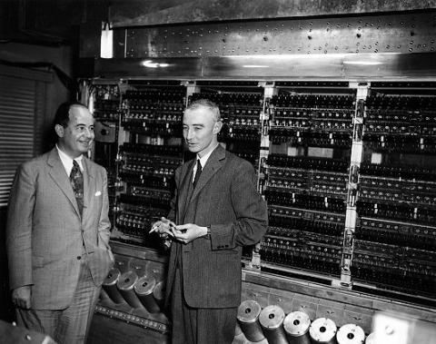
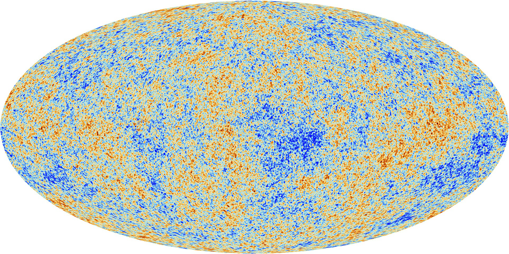
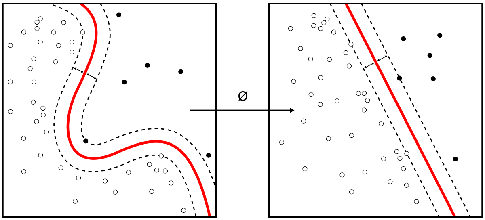
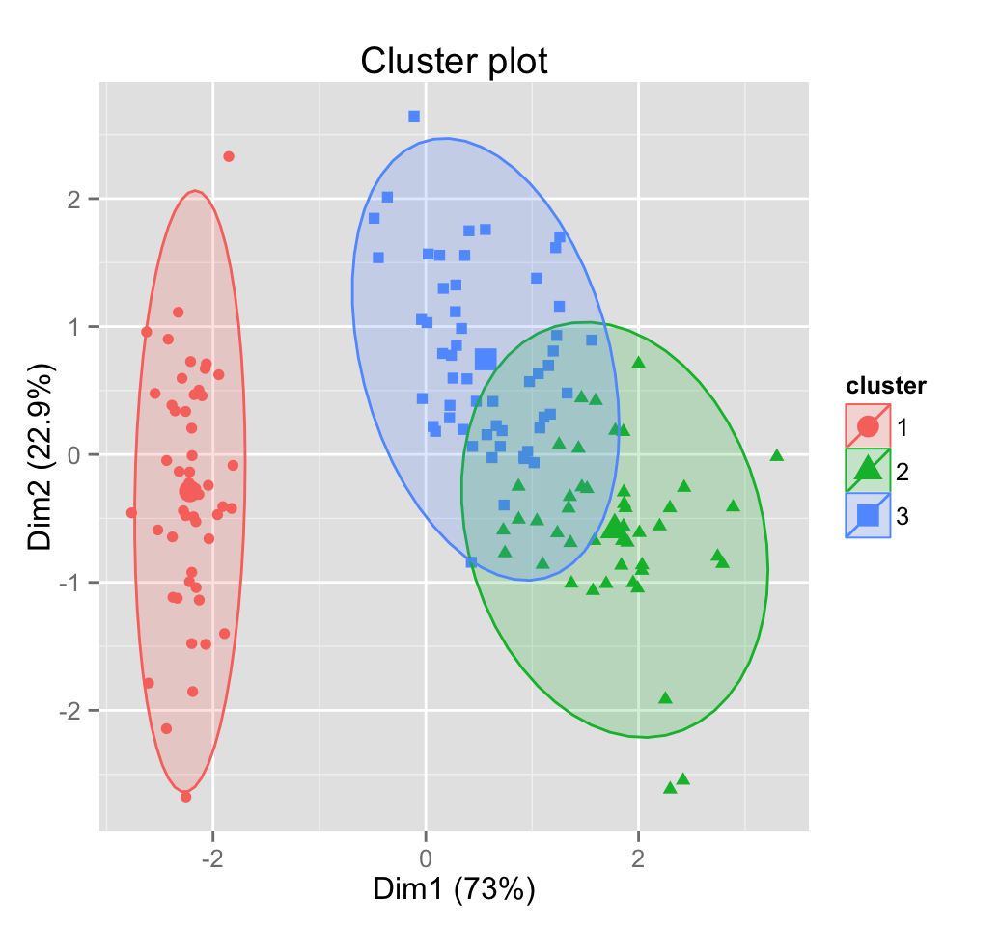
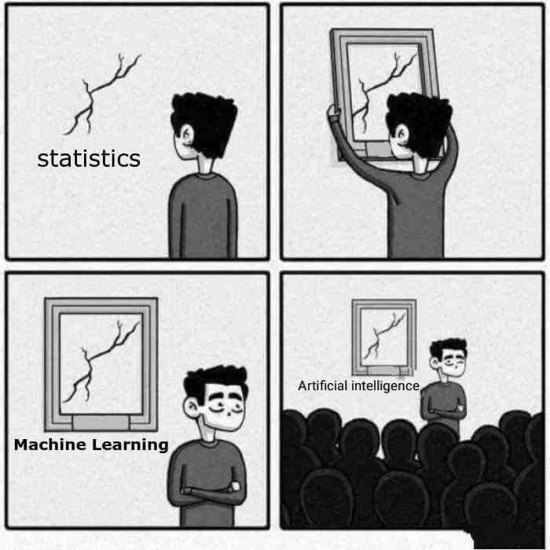

## Machine Learning vs Traditional Modelling
Most computational scientists are comfortable with the idea of numerical or computational modelling. 
Having been indoctrinated into a world of physically explainable and broadly intuitive equations, the physical scientist is trained to believe that everything can be modelled from a first principles construction.
Literally modelling every interaction from the ground up.
This approach has been enourmously successful enabling humans to; create weapons of mass destruction, land on the moon and even see into the earliest days of our universe.
But as we seek to explain ever more nuanced aspects of the observable universe we quickly encounter scenarios for which we have no equations and behaviours for which we have no intuition.

:-------------------------:|:-------------------------:|:-------------------:|
 |   | 
:-------------------------:|:-------------------------:|:-------------------:|
_Manhatan Project_     |  _Apollo Missions_         |  _Cosmic Microwave Background_ |

> ## Discussion
>
> Can you give some examples of successful model based approaches in your science domain?
> Can you think of instances where a physical model is too cumbersome, complex or expensive?
> 
{: .discussion}

Enter **machine learning**. As an alternative to explicitly designing model interactions, we can observe these interactions in data. Furthermore we can design algorithms that "learn" from data, such that they would be able to recognise patterns should they occur again. More formally [(Mitchell, 1997)](#mitchell2017) defines machine learning as

> A computer program is said to learn from experience $E$ with respect to some class of tasks $T$ and performance measure $P$, if its performance at tasks in $T$, as measured by $P$, improves with experience $E$.
{: .quotation}

So basically, machine learning is getting the computer to do things better by making it do those things repeatedly.
The set of tasks, $T$, performance measures, $P$, and experiences, $E$, available to practioners is quite large, however throughout this workshop we will explain and expand upon each element highlighting important aspects of each.
In general the experiences, $E$, generally involve expsoure to large datasets.
This means that your data (experiences) are critical to the ultimate performance of your model.
The old adage, garbage in garbage out, is frequently used to describe a bad machine learning workflow.
This point will be emphasised repeatedly throughout this workshop.

:-------------------------:|:-------------------------:|:-------------------:|
 |   | 
:-------------------------:|:-------------------------:|:-------------------:|
_Classification_     |  _Regression_         |  _Clustering_ |

> ## Discussion
>
> Could you cast some of the challenges you face in your research as "learning" tasks? What would be the appropriate task, performance measure and experience?
> Is it possible to solve the difficult examples we discussed before with a learned approach?
> 
{: .discussion}

## Machine Learning vs Statistical Modelling
Often, owing to the similarity of methods that are used in statistical modeling and in machine learning, people will assume that they are the same thing. 
Or even go so far as to claim that machine learning is just "[glorified statistics](https://eranraviv.com/machine-learning-simply-statistics/)," or suggest that machine learning is to statistics as engineering is to physics.

This dicussion goes beyond keyboard warriors on Twitter, [(Bzdok, Altman, & Krzywinski, 2018)](#bzdok2018) give a great discussion in Nature Methods.
As we discussed above in machine learning the focus is getting a computer (machine) to "learn" something, using (as we shall see over the coming days) a subset of our data. We do not know how well the model will perform until we "test" the learned representation on additional data that was not present during training, called the test set. 
The purpose of machine learning, in this case, is to obtain the best performance on the test set, i.e. generate the most accurate predictions.

For the statistical model, we might, for example, find a line that minimizes the mean squared error across all of the data, assuming the data to be a linear regressor with some random noise added. No training and no test set are necessary. For many cases, especially in research, the point of our model is to characterize the relationship between the data and our outcome variable, not to make predictions about future data. We call this procedure statistical inference, as opposed to prediction. However, we can still use this model to make predictions, and this may be your primary purpose, but the way the model is evaluated will not involve a test set and will instead involve evaluating the significance and robustness of the model parameters.

> ## Discussion
>
> Do you agree with the characterisation above? What are some statistical inference problems you have tackled? Was you primary goal **statistical inference** as opposed to prediction?
> 
{: .discussion}

> ## Challenge
>
> Could you identify which of the following are appropriate tasks for machine learning, physical modelling or statistical inference?
> 
> 1. Predicting future weather behaviours using results from a compute intensive physical model.
> 2. Designing an optimal aerodynamics package for a race vehicle using robust Computational Fluid Dynamics models.
> 3. Using expensive genomic data to characterise the relationship between the expression of a particular gene and the occurance of a particular phenotype.
> 4. Combining historical weather and stock price data to predict growth in weather dependant industries like agriculture, renewable energy or tourism.
> 5. Building a model to estimate crop yeilds from remotely sensed data.
> 
>> ## Solution
>> 
>> 1. Physical modeling. Although in practise the BoM uses a combination of physics based and statistics based models.
>> 2. Physical modeling. A corner stone of the computational modelling domain, CFD is a massive industry with a deep history of successful application to many industrially relevant problems.
>> 3. Statistical inference. Here we just want to understand the functional relationship between genotypes and phenotypes, we wish to characterise how one variable affects another.
>> 4. Machine Learning. Here we are trying to train a model to learn the relationship between stock price and weather behaviour so as to make accuracte predictions of future stock performance, and make millions of dollars. Alternatively you may have just been curious as to whether or not the two datasets were correlated in any meaningful way to try an understand particular patterns in the stock market. This would be statistical inference.
>> 5. Machine learning. Only if you directly train something to accept remotely sense images and output future crop yeilds. You could also combine physical and statistcal modelling to analyse particular vegetation indices which might have been shown to correlate to biomass and future crop yeilds.
>> 
>{: .solution}
{: .challenge}

## References

[Bzdok, D., Altman, N., & Krzywinski, M. (2018). *Statistics versus machine learning. Nature Methods, 15*(4), 233–234. https://doi.org/10.1038/nmeth.4642](https://www.nature.com/articles/nmeth.4642)

[Mitchell, T. M. (Tom M. (1997). *Machine Learning* (1st ed.). McGraw-Hill Education.](http://www.cs.cmu.edu/afs/cs.cmu.edu/user/mitchell/ftp/mlbook.html)


