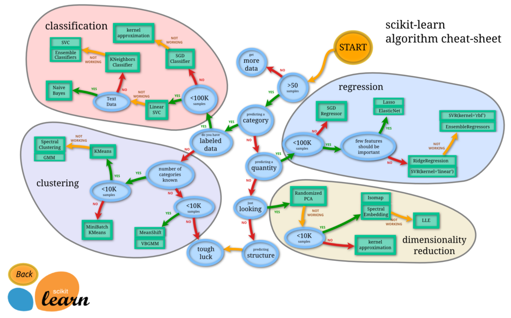

*[scikit-learn algorithm cheat sheet](https://scikit-learn.org/stable/tutorial/machine_learning_map/)*

The following taxonomy draws heavily from Chapter 5, Machine Learning Basics in [(Goodfellow, Bengio, & Courville, 2016)](#goodfellow2016)

## The Experience, *E*

Typically, the experience a machine learning algorithm encounters during learning is in the form of a dataset, or exposure to a dataset (or subset thereof).
A dataset is a collection of **examples**, each example comprising a set of **features** that have been quantitatively measured from some object or event.
We typically represent an example as a vector , where each entry  of the vector is another feature.
Broadly speaking, experiences are often categorised as either **unsupervised** or **supervised**.

>**Unsupervised learning algorithms** experience a datset containing many features, then learn useful properties of the structure of this dataset.
>
>**Supervised learning algorithms** experience a dataset containing features, but each example is also associated with a **label** or **target**. 
>
>Roughly speaking, unsupervised learning involves observing several examples of a radnom vector **x** and attempting to implicitly or explicitly learn the probability distribution *p(***x***)*, or some interesting properties of that distribution; while supervised learning involves observing several examples of random vector **x** and an associated value or vector **y**, then learning the predict **y** from **x**, usually by estimating *p(***y**\|**x***)*.
{: .quotation}
[(Goodfellow, Bengio, & Courville, 2016)](#goodfellow2016)

The types of experiences are not necessarilly mutaully exclusive.
Often times a single problem may involve the use of either one of the above techniques, most likely both and potentially a hybrid of the two.

For completeneness, when characterising the types of experiences available to a machine learning algorithm we will also include **reinforcement learning**.
Reinforcement learning algorithms work with a dataset that is not necessarilly fixed, these algorithms interact with their environment such that there is a feedback loop between the learning system and its experiences.

> ## Challenge
>
> Try to identify the type of experience for each of the examples below.
> 
> 1. 
> 
>> ## Solution
>>
>> Could you identify which of the following are appropriate tasks for machine learning, physical modelling or statistical inference?
>> 
> {: .solution}
{: .challenge}

## The Task, *T*

classification
classification with missing inputs
regression
transcription
machine translation
structured output
pattern recognition
prediction
discriminant
knowledge extraction
compression
outlier detection
novelty detection
ranking
density estimation
clustering
reinforcement learning
synthesis and sampling
imputation
denoising

Many kinds of tasks can be solved with machine learning. Some of the mostcommon machine learning tasks include the following:

• **Classification**: In this type of task, the computer program is asked to specifywhich ofkcategories some input belongs to. To solve this task, the learningalgorithm is usually asked to produce a functionf:Rn→ {1, . . . , k}. Wheny=f(x), the model assigns an input described by vectorxto a categoryidentified by numeric codey. There are other variants of the classificationtask, for example, wherefoutputs a probability distribution over classes.An example of a classification task is object recognition, where the inputis an image (usually described as a set of pixel brightness values), and theoutput is a numeric code identifying the object in the image. For example,the Willow Garage PR2 robot is able to act as a waiter that can recognizedifferent kinds of drinks and deliver them to people on command (Good-fellow et al., 2010). Modern object recognition is best accomplished withdeep learning (Krizhevsky et al., 2012; Ioffe and Szegedy, 2015). Objectrecognition is the same basic technology that enables computers to recognizefaces (Taigman et al., 2014), which can be used to automatically tag peoplein photo collections and for computers to interact more naturally with theirusers.

• **Classification with missing inputs**: Classification becomes more chal-lenging if the computer program is not guaranteed that every measurement inits input vector will always be provided. To solve the classification task, thelearning algorithm only has to define a single function mapping from a vectorinput to a categorical output. When some of the inputs may be missing,rather than providing a single classification function, the learning algorithmmust learn a set of functions. Each function corresponds to classifyingxwitha different subset of its inputs missing. This kind of situation arises frequentlyin medical diagnosis, because many kinds of medical tests are expensive orinvasive. One way to efficiently define such a large set of functions is tolearn a probability distribution over all the relevant variables, then solve theclassification task by marginalizing out the missing variables. Withninputvariables, we can now obtain all 2ndifferent classification functions neededfor each possible set of missing inputs, but the computer program needsto learn only a single function describing the joint probability distribution.See Goodfellow et al. (2013b) for an example of a deep probabilistic modelapplied to such a task in this way. Many of the other tasks described in thissection can also be generalized to work with missing inputs; classificationwith missing inputs is just one example of what machine learning can do.

**Regression**: In this type of task, the computer program is asked to predict anumerical value given some input. To solve this task, the learning algorithmis asked to output a functionf:Rn→ R. This type of task is similar toclassification, except that the format of output is different. An example ofa regression task is the prediction of the expected claim amount that aninsured person will make (used to set insurance premiums), or the predictionof future prices of securities. These kinds of predictions are also used foralgorithmic trading.

• **Transcription**: In this type of task, the machine learning system is askedto observe a relatively unstructured representation of some kind of dataand transcribe the information into discrete textual form. For example, inoptical character recognition, the computer program is shown a photographcontaining an image of text and is asked to return this text in the form ofa sequence of characters (e.g., in ASCII or Unicode format). Google StreetView uses deep learning to process address numbers in this way (Goodfellowet al., 2014d). Another example is speech recognition, where the computerprogram is provided an audio waveform and emits a sequence of characters orword ID codes describing the words that were spoken in the audio recording.Deep learning is a crucial component of modern speech recognition systemsused at major companies, including Microsoft, IBM and Google (Hintonet al., 2012b).

• **Machine translation**: In a machine translation task, the input alreadyconsists of a sequence of symbols in some language, and the computer programmust convert this into a sequence of symbols in another language. This iscommonly applied to natural languages, such as translating from English toFrench. Deep learning has recently begun to have an important impact onthis kind of task (Sutskever et al., 2014; Bahdanau et al., 2015).

• **Structured output**: Structured output tasks involve any task where theoutput is a vector (or other data structure containing multiple values) withimportant relationships between the different elements. This is a broadcategory and subsumes the transcription and translation tasks describedabove, as well as many other tasks. One example is parsing—mapping anatural language sentence into a tree that describes its grammatical structureby tagging nodes of the trees as being verbs, nouns, adverbs, and so on.See Collobert (2011) for an example of deep learning applied to a parsingtask. Another example is pixel-wise segmentation of images, where thecomputer program assigns every pixel in an image to a specific category. For example, deep learning can be used to annotate the locations of roadsin aerial photographs (Mnih and Hinton, 2010). The output form neednot mirror the structure of the input as closely as in these annotation-styletasks. For example, in image captioning, the computer program observes animage and outputs a natural language sentence describing the image (Kiroset al., 2014a,b; Mao et al., 2015; Vinyals et al., 2015b; Donahue et al., 2014;Karpathy and Li, 2015; Fang et al., 2015; Xu et al., 2015). These tasksare called structured output tasks because the program must output severalvalues that are all tightly interrelated. For example, the words produced byan image captioning program must form a valid sentence.

• **Anomaly detection**: In this type of task, the computer program siftsthrough a set of events or objects and flags some of them as being unusualor atypical. An example of an anomaly detection task is credit card frauddetection. By modeling your purchasing habits, a credit card company candetect misuse of your cards. If a thief steals your credit card or credit cardinformation, the thief’s purchases will often come from a different probabilitydistribution over purchase types than your own. The credit card companycan prevent fraud by placing a hold on an account as soon as that card hasbeen used for an uncharacteristic purchase. See Chandola et al. (2009) for asurvey of anomaly detection methods.

• **Synthesis and sampling**: In this type of task, the machine learning al-gorithm is asked to generate new examples that are similar to those in thetraining data. Synthesis and sampling via machine learning can be usefulfor media applications when generating large volumes of content by handwould be expensive, boring, or require too much time. For example, videogames can automatically generate textures for large objects or landscapes,rather than requiring an artist to manually label each pixel (Luo et al., 2013).In some cases, we want the sampling or synthesis procedure to generate aspecific kind of output given the input. For example, in a speech synthesistask, we provide a written sentence and ask the program to emit an audiowaveform containing a spoken version of that sentence. This is a kind ofstructured output task, but with the added qualification that there is nosingle correct output for each input, and we explicitly desire a large amountof variation in the output, in order for the output to seem more natural andrealistic.

• **Imputation of missing values**: In this type of task, the machine learningalgorithm is given a new examplex ∈ Rn, but with some entriesxiofx missing. The algorithm must provide a prediction of the values of the missingentries.• Denoising: In this type of task, the machine learning algorithm is given asinput a corrupted example˜x ∈ Rnobtained by an unknown corruption processfrom a clean examplex ∈ Rn. The learner must predict the clean examplexfrom its corrupted version˜x, or more generally predict the conditionalprobability distribution p(x \|˜x).

• **Density estimationorprobability mass function estimation**: In thedensity estimation problem, the machine learning algorithm is asked to learn afunctionpmodel:Rn→ R, wherepmodel(x) can be interpreted as a probabilitydensity function (ifxis continuous) or a probability mass function (ifxisdiscrete) on the space that the examples were drawn from. To do such a taskwell (we will specify exactly what that means when we discuss performancemeasuresP), the algorithm needs to learn the structure of the data it has seen.It must know where examples cluster tightly and where they are unlikely tooccur. Most of the tasks described above require the learning algorithm to atleast implicitly capture the structure of the probability distribution. Densityestimation enables us to explicitly capture that distribution. In principle,we can then perform computations on that distribution to solve the othertasks as well. For example, if we have performed density estimation to obtaina probability distributionp(x), we can use that distribution to solve themissing value imputation task. If a valuexiis missing, and all the othervalues, denotedx−i, are given, then we know the distribution over it is givenbyp(xi\| x−i). In practice, density estimation does not always enable us tosolve all these related tasks, because in many cases the required operationson p(x) are computationally intractable.Of course, many other tasks and types of tasks are possible. The types of taskswe list here are intended only to provide examples of what machine learning cando, not to define a rigid taxonomy of tasks

> ## Challenge
>
> Idenitfy the type of task.
> 
>> ## Solution
>>
>> Could you identify which of the following are appropriate tasks for machine learning, physical modelling or statistical inference?
>> 
>{: .solution}
{: .challenge}

## The Performance Measure, *P*

Accuracy
Error rate
test set

> ## Challenge
>
> Idenitfy the type of measure.
> 
>> ## Solution
>>
>> Could you identify which of the following are appropriate tasks for machine learning, physical modelling or statistical inference?
>> 
>{: .solution}
{: .challenge}

**Ep 3: Types of ML**
_No code_
- Supervised
- Unsupervised
- Classification
- Regression
- Deep learning

## References

[Goodfellow, I., Bengio, Y., & Courville, A. (2016). Deep Learning. MIT Press. Retrieved from https://www.deeplearningbook.org](https://www.deeplearningbook.org)


